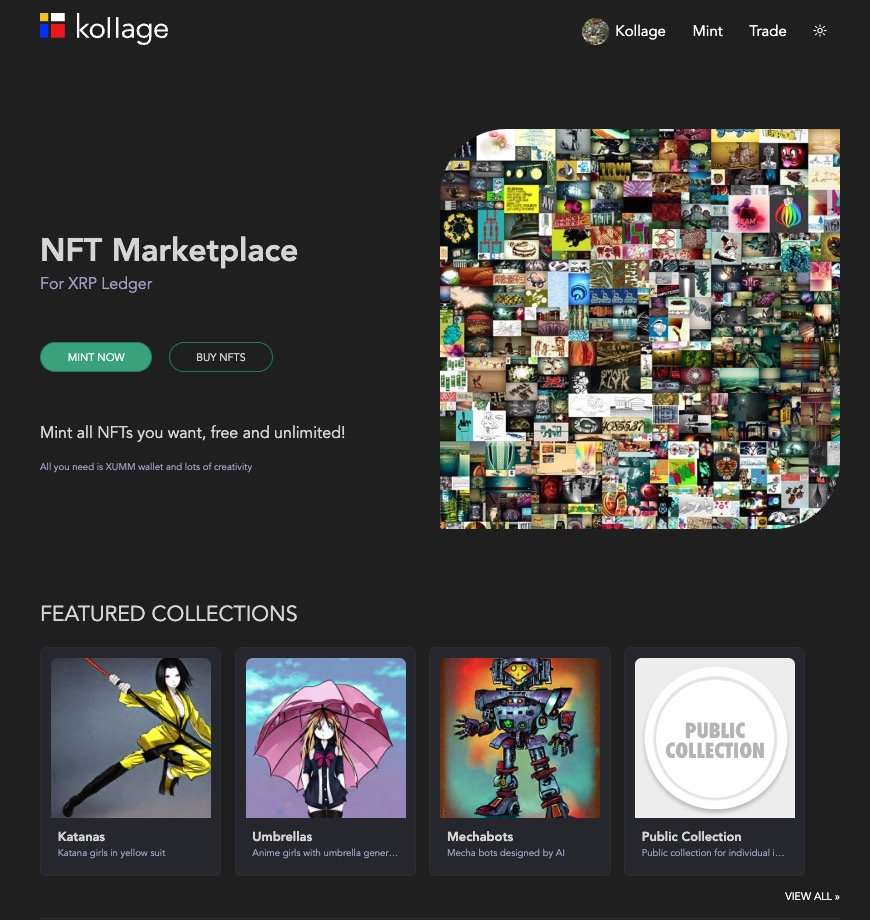

# KOLLAGE

## NFT Marketplace For XRP Ledger

Kollage allows you to mint all NFTs you want in XRP Ledger, free and unlimited!

## Setup

Built with NodeJS on the server and PostgreSQL for ledger replication

PostgreSQL must be installed and database `kollage` created according to the [schema](src/schema.sql)

All you need to do is clone the repo and run `npm install` to have all dependencies ready

Then run `node index` to start the app

